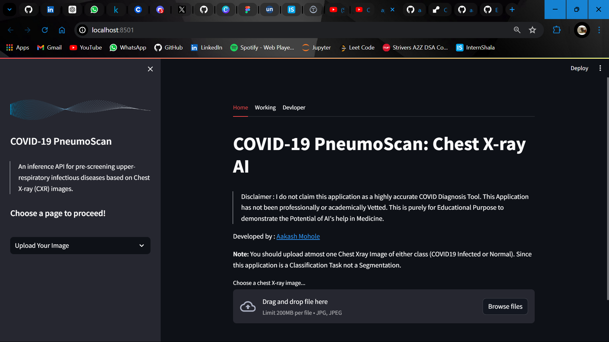
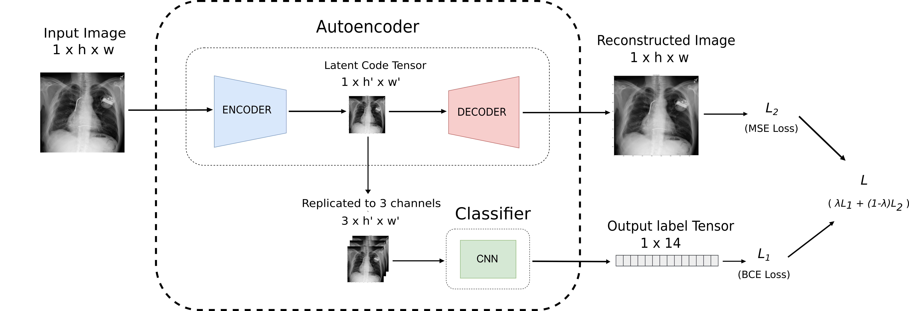
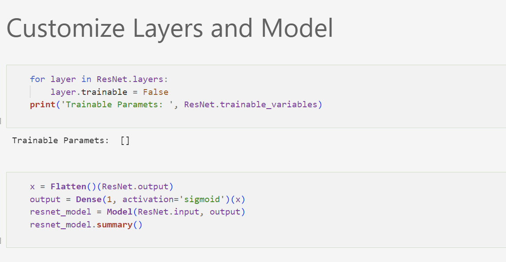
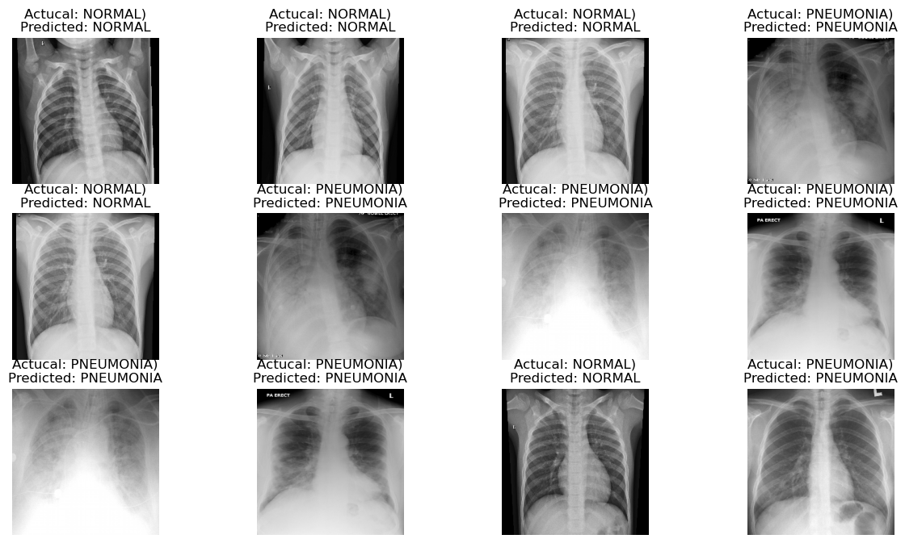
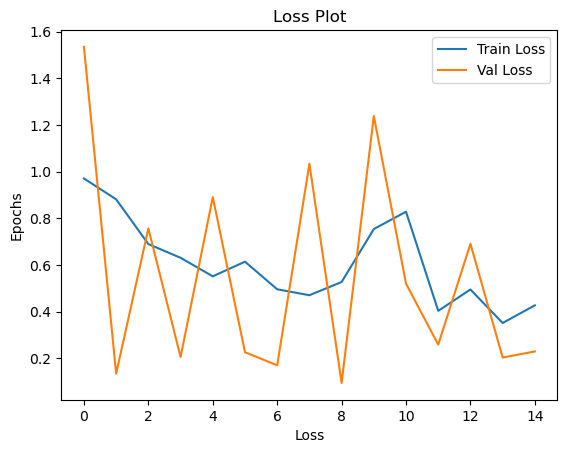

How to reach me: Connect with me on Twitter [@Aakash Mohole](https://twitter.com/AakashMohole) | Linkedin [@Aakash Mohole](https://www.linkedin.com/in/aakash-mohole-231359233/)

 # COVID-19-PneumoScan-Chest-X-ray-AI


🟢 Click on the image to see the demo video:

[](https://youtu.be/I4qK5sX8jkI)

## Working 


## Encoder, Decoder, and Autoencoder
Overview of AE-CNN: Our proposed framework consists of three main blocks namely encoder, decoder, and classifier. The figure shows the autoencoder based convolutional neural network (AE-CNN) model for disease classification. Here, autoencoder reduces the spatial dimension of the input image of size 1024 × 1024. The encoder produces a latent code tensor of size 256 × 256 and decoder reconstructs back the image. This latent code tensor is passed through a CNN classifier for classifying the chest x-rays. The final loss is the weighted sum of the reconstruction loss by the decoder and classification loss by the CNN classifier.

### Encoder:
> **Function:** The encoder compresses the input data into a latent-space representation. In the context of an image, it extracts important features and reduces the dimensionality.  
> **Architecture:** Typically consists of convolutional layers followed by pooling layers. For example, in ResNet-50, the initial layers can be considered part of the encoder as they extract features from the input image.

### Decoder:
> **Function:** The decoder reconstructs the input data from the latent-space representation. This is used in tasks where output images are required (e.g., image generation or segmentation).  
> **Architecture:** Typically consists of upsampling layers (like transposed convolutions) that increase the dimensionality of the latent representation back to the original input size.

### Autoencoder:
> **Function:** An autoencoder is a type of neural network used to learn efficient codings of input data. It consists of two parts: the encoder and the decoder. The goal is to compress the input into a latent-space representation and then reconstruct the output as closely as possible to the original input.  
> **Architecture:** Combines both the encoder and decoder. The encoder reduces the input to a latent space, and the decoder reconstructs the input from this latent space.

## ResNet-50 Model for COVID-19 Detection Using Chest X-Ray
**ResNet-50 (Residual Network):**  
ResNet-50 is a deep convolutional neural network that is 50 layers deep. It is well-known for its ability to handle the vanishing gradient problem, which is common in very deep networks. This is achieved through the introduction of residual blocks.



### Feature Extraction with ResNet-50 Encoder
The **ResNet-50** model's convolutional layers act as an encoder, extracting high-level features from chest X-ray images.

### Classification Head
After feature extraction, a global average pooling layer and a fully connected layer are added to classify the image as **COVID-19 positive** or **negative**.

### Training
The model is trained on a labeled dataset of chest X-ray images, with labels indicating the presence or absence of COVID-19.

### Evaluation
The model is evaluated on a separate test set to measure its accuracy, sensitivity, specificity, and other relevant metrics.

## Prediction Output -


## Training Progress Chart -



## Tools ⚙️

### Libraries & Framework:


### Language:


## Setting Up

To run the web application locally, follow these steps:

Clone this repository

``` bash
git clone https://github.com/aakashmohole/COVID-19-PneumoScan-Chest-X-ray-AI.git
```

Install the necessary dependencies using 

``` bash
 pip install -r requirements.txt
```

Run the Streamlit application using 

``` bash
cd app
```

``` bash
streamlit run app.py
```

Access the application in your web browser at http://localhost:5000.


